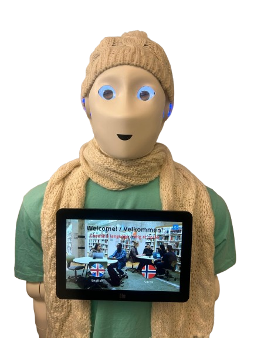

# ARI Østfold University College Receptionist

This repository contains the source code and assets used in an end-user study to validate the **SecuRoPS** framework using the **ARI social robot** from PAL Robotics. The study was conducted at Østfold University College and integrates multiple reusable components built on the PAL Robotics SDK 23.12.

## 🧠 Project Purpose

This application enables the ARI robot to serve as an interactive receptionist. It presents university study programs, collects visitor interest, and showcases multimedia content through an engaging voice-enabled interface. The robot operates autonomously with preloaded visual and spoken interactions in both English and Norwegian.

---

## 🔍 Features

- **Web Page Presentation**  
  ARI displays multilingual content (English and Norwegian) using a responsive HTML/CSS/JS interface.

- **Picture Slideshow**  
  Multiple photos are displayed as a seamless slideshow to showcase campus life or study programs.

- **Video Content Integration**  
  External video links (hosted outside GitHub) are used to present informative content without exceeding GitHub LFS limits.

- **PowerPoint-Style Navigation**  
  Information about study programs is presented in a presentation-style flow.

- **Custom Virtual Keyboard**  
  A touchscreen-compatible keyboard is integrated to collect user input (name and email) securely.

- **Application Controller**  
  The `application_controller.py` script uses PAL’s `pal_app` to capture and store user interaction data on the robot.

---

## 🛠️ Technologies Used

- PAL Robotics SDK 23.12
- HTML, CSS, JavaScript
- Python (for robot-side data handling)
- ARI robot touchscreen interface
- Git LFS (for earlier video handling — now removed in favor of external links)

---

## 🔒 Privacy & Ethics

This study does not collect any sensitive personal data. All user interactions are anonymized, and the robot operates solely within the bounds of public educational outreach.

---

## 📢 Acknowledgements

- Østfold University College  
- PAL Robotics  
- NTNU Information Security Group  (CISAR)
- SecuRoPS Project Partners
- Study participants for contributing to the evaluation of the SecuRoPS framework

---

## Citation

If you use this code or the SecuRoPS framework in your research, please cite the following paper:
**Oruma, S.O.; Colomo-Palacios, R.; Gkioulos, V. From Framework to Reliable Practice: End-User Perspectives on Social Robots in Public Spaces. Systems 2026, 14, 137. https://doi.org/10.3390/systems14020137**

### BibTex
@Article{systems14020137,
AUTHOR = {Oruma, Samson Ogheneovo and Colomo-Palacios, Ricardo and Gkioulos, Vasileios},
TITLE = {From Framework to Reliable Practice: End-User Perspectives on Social Robots in Public Spaces},
JOURNAL = {Systems},
VOLUME = {14},
YEAR = {2026},
NUMBER = {2},
ARTICLE-NUMBER = {137},
URL = {https://www.mdpi.com/2079-8954/14/2/137},
ISSN = {2079-8954},
DOI = {10.3390/systems14020137}
}
---

## 📬 Contact

For questions, contributions, or collaborations:

**Samson Oruma**  
📧 samsonoo@ntnu.no  
🌐 https://www.linkedin.com/in/samsonoruma/

